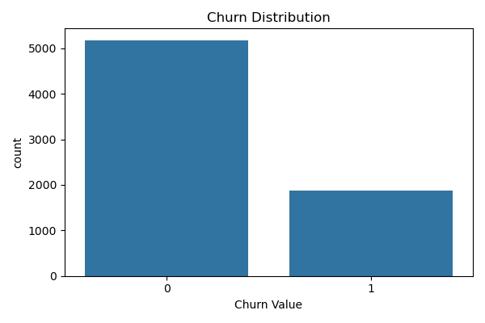
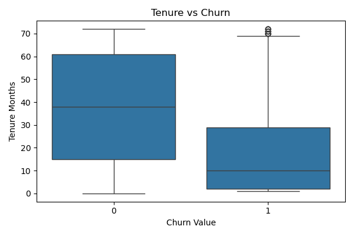
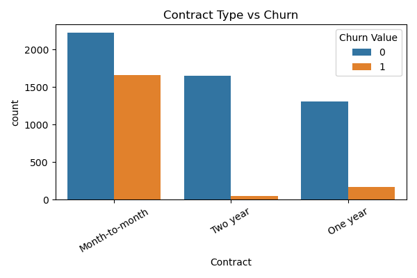
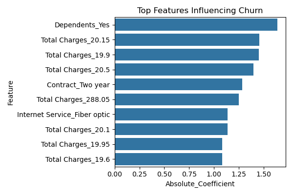
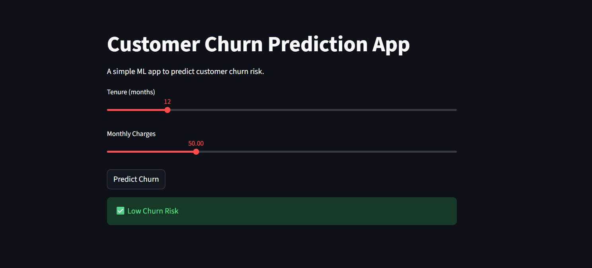

# Customer Churn Prediction – End-to-End ML Project

## Problem Statement
Customer churn is a critical problem for subscription-based businesses. This project aims to predict customer churn and identify key drivers behind customer attrition using machine learning.

## Dataset
Telco customer churn dataset containing customer demographics, service usage, and billing information.

## Approach
- Performed exploratory data analysis (EDA) to identify churn patterns
- Handled data leakage by removing post-churn variables
- Applied one-hot encoding for categorical features
- Built and evaluated Logistic Regression and Random Forest models
- Selected Logistic Regression based on recall performance
- Interpreted model coefficients to extract business insights

## Results
- Accuracy: ~80%
- Recall (Churn): ~57%
- Key churn drivers: high total charges, short-term contracts

## Key Takeaways
- Customer churn is highest among low-tenure, month-to-month customers.
- High total charges are strongly associated with churn risk.
- Long-term contracts significantly improve customer retention.
- Logistic Regression performed better than Random Forest for this high-dimensional dataset.

## Business Recommendations
- Offer personalized discounts to high-spending customers
- Encourage long-term contracts through incentives

## Tools Used
Python, Pandas, NumPy, Seaborn, Scikit-learn, Jupyter Notebook

## Results & Key Insights

### Churn Distribution


- Majority of customers do not churn, indicating class imbalance.

### Tenure vs Churn


- Customers with low tenure are more likely to churn.

### Contract Type vs Churn


- Month-to-month contracts show the highest churn risk.

### Key Features Influencing Churn


- High total charges increase churn risk.
- Long-term contracts significantly reduce churn.

## Streamlit App (Demo)

A simple interactive web app built using Streamlit to demonstrate churn prediction.

**Features used:**
- Tenure Months
- Monthly Charges

**How to run locally:**
```bash
pip install streamlit
streamlit run app.py
```
### Streamlit App Preview



